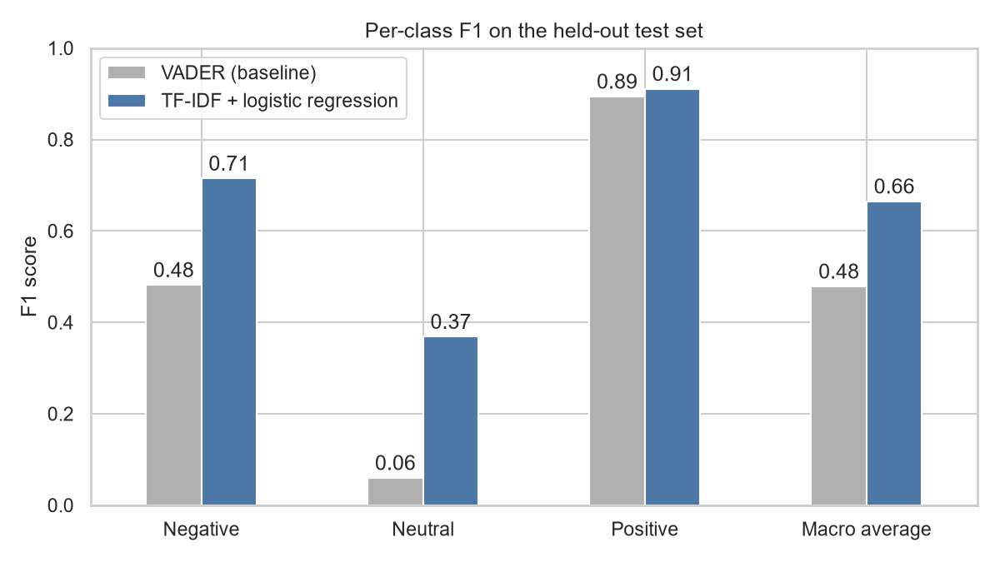
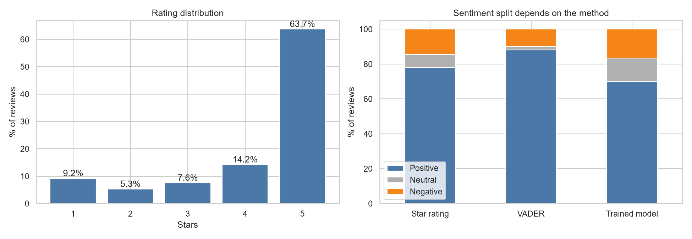
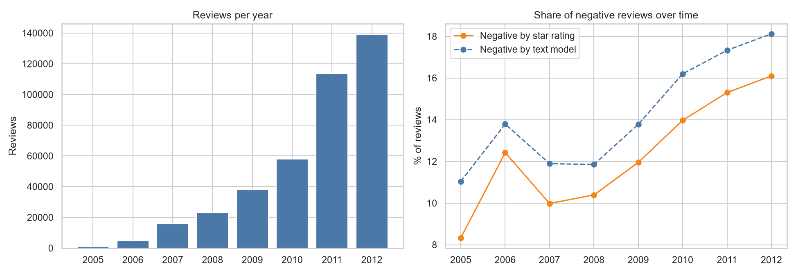
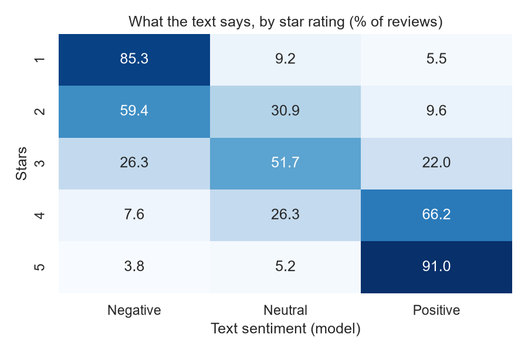
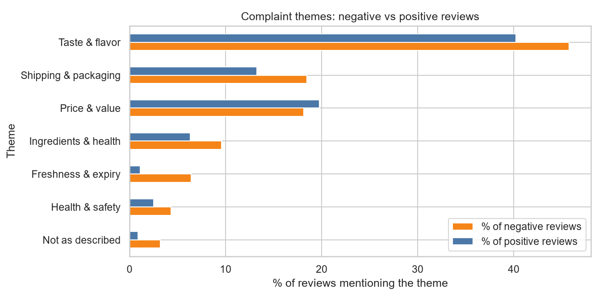
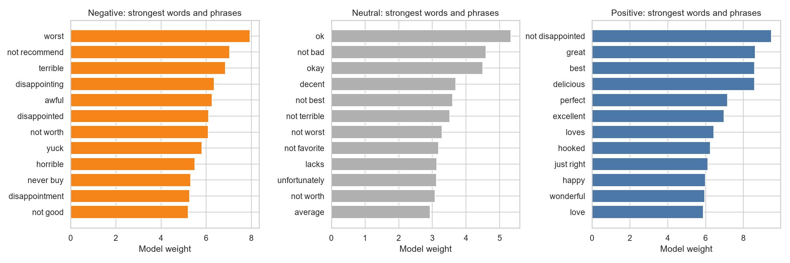

# Amazon Customer Sentiment Analysis

Week 4 project for the **Syntecxhub Data Analysis Internship**. Sentiment analysis of ~394K Amazon food reviews: a lexicon baseline (VADER) is validated against star ratings, compared with a trained text classifier (TF-IDF + logistic regression), and then used to study sentiment trends, complaint themes and review helpfulness.



## Objective

Clean and preprocess Amazon review text, classify each review as positive, negative or neutral, identify patterns in customer feedback and ratings, visualize sentiment distribution and trends, and turn the findings into insights for product improvement and customer satisfaction.

## Dataset

- **Source:** [Amazon Fine Food Reviews](https://www.kaggle.com/datasets/snap/amazon-fine-food-reviews) (Stanford SNAP, via Kaggle). Citation: J. McAuley and J. Leskovec, *From amateurs to connoisseurs: modeling the evolution of user expertise through online reviews*, WWW 2013.
- **Size:** 568,454 raw reviews x 10 columns, Oct 1999 to Oct 2012 → **393,931 reviews** after cleaning
- **Fields:** ProductId, UserId, HelpfulnessNumerator/Denominator, Score (1-5 stars), Time, Summary, Text
- The full file (~300MB) exceeds GitHub's 100MB limit and is not included. `data/Reviews_sample.csv` holds the first 5,000 rows to show the schema. See *How to reproduce* below.

## Tools Used

- **Python:** pandas, NumPy, scikit-learn, vaderSentiment, matplotlib, seaborn
- **Zed** (Jupyter-style `# %%` cells) for analysis; long jobs run as standalone scripts

## Data Cleaning

- **Removed 174,523 rows**: 174,521 duplicate reviews (the same user, time and text attached to several product variants, which would otherwise inflate every count) and 2 rows with impossible helpfulness values (helpful votes greater than total votes).
- **Stripped HTML tags** (present in 103,109 of the remaining reviews, 26%) and **URLs** (8,115 reviews).
- **Filled 27 missing summaries** with empty strings; converted Unix timestamps to dates.
- **Deliberately kept case and punctuation** for VADER, since capitalization and exclamation marks carry intensity. Stopwords were removed only for the TF-IDF model, **with negation words kept** ("not good" must not collapse into "good").

## Methodology

1. **Reference labels from star ratings:** 1-2 stars = Negative, 3 = Neutral, 4-5 = Positive (14.5% / 7.6% / 77.9% of reviews).
2. **Baseline: VADER** compound score on the review text, with the standard +/-0.05 cut-offs.
3. **Trained model: TF-IDF (unigrams + bigrams, 100K features) + multinomial logistic regression** with balanced class weights, evaluated on a stratified 80/20 held-out split.
4. **Evaluation by per-class precision, recall and F1, and macro F1, not accuracy.** The classes are imbalanced: labelling every review "Positive" would already score 77.9% accuracy.
5. **Out-of-fold labelling:** every review was labelled by 3-fold cross-validation, so no review is scored by a model that trained on it. The out-of-fold macro F1 (0.66) matches the held-out result.

## Results

| | VADER (baseline) | TF-IDF + logistic regression |
|---|---|---|
| Macro F1 | 0.48 | **0.66** |
| Negative F1 / recall | 0.48 / 0.40 | **0.71 / 0.76** |
| Neutral F1 | 0.06 | **0.37** |
| Positive F1 | 0.89 | 0.91 |
| Accuracy | 0.80 | 0.82 |

Accuracy barely moved while macro F1 rose from 0.48 to 0.66, which is why accuracy was not used to judge the models.

## Key Insights



- **The headline number depends on the method.** 77.9% of reviews are positive by star rating, but VADER says 88.0% and the trained model 70.0%. VADER flags only 40% of negative reviews and labels 55% of 1-2 star reviews as positive. The model over-predicts the smaller classes by design (balanced class weights). Headline shares are therefore quoted from ratings, and the model is used to read individual reviews.
- **VADER degrades on long reviews.** Agreement with the star label falls from 84% (25 words or fewer) to 74% (over 200 words), while the share of near-extreme scores rises from 16% to 82%: scores saturate and stop separating mixed reviews from positive ones.



- **Volume grew from about 1,000 reviews in 2005 to 139,000 in 2012** (2012 is a partial year, ending 26 Oct). **Average rating has fallen every year since 2007 (4.39 to 4.11)** and the negative share by stars rose from 10.0% to 16.1%. The text model shows the same direction (11.9% to 18.1%). The data cannot say why.



- **Review text tracks the star rating in a graded way.** 85% of 1-star reviews read negative and 91% of 5-star reviews read positive. 3-star reviews are mostly Neutral (52%), and 2-star reviews split 59% Negative / 31% Neutral.



- **Complaint themes, compared against positive reviews (lift = how much more common in negative reviews):**
  - **Freshness and expiry: 5.8x** (6.4% of negative reviews vs 1.1% of positive)
  - **Not as described: 3.6x** (3.2% vs 0.9%)
  - Health and safety 1.7x, ingredients 1.5x, shipping and packaging 1.4x
  - **Taste (1.1x) and price (0.9x) are discussed about equally by happy and unhappy customers**, so mentioning them does not predict a negative review.



- **Helpfulness:** 1-star reviews are about 3x as likely as 5-star reviews to attract 5+ votes (29.7% vs 9.7%), but their median helpful ratio is lower (0.57 vs 1.00), so negative reviews draw attention and are also contested. Neutral reviews are the longest (median 70 words vs 63 negative and 54 positive).

### Recommendations for product improvement

- **Tighten freshness controls:** stock rotation, expiry-date checks before dispatch and best-before dates on listings address the most negative-specific theme.
- **Improve listing accuracy:** claims such as "organic" or "raw", and certifications such as halal, drive "not as described" complaints.
- **Review packaging and shipping-cost transparency:** reviews describe boxes arriving open, and in one case shipping costing more than the product.
- **Escalate health and safety mentions** (for example pets becoming ill), which are rare but severe.

## Limitations

- **Star rating is a noisy proxy for text sentiment**, especially for 3-star reviews, which are often mixed. This caps the Neutral class (F1 0.37).
- **The model is bag-of-words.** It misses reviews that start positive and then turn ("I was a big fan... until my cat became sick") and can pick up negative words used off-target. In a manual read of 16 mismatched reviews, 3 of 8 "4-5 star but negative text" cases were genuine complaints or mixed reviews, and 6 of 8 "1-2 star but positive text" cases were negative reviews the model missed. This is a small sample and indicative only.
- **Theme counts are keyword mentions, not sentiment**, and the theme list is not exhaustive.
- The train/test split is random by review, not grouped by user or product.
- The dataset covers food products only and has product IDs but no names or categories, so insights are at platform level.

## How to reproduce

1. Download `Reviews.csv` from Kaggle into `data/`.
2. `pip install -r requirements.txt`
3. Run in order from the project root:
   - `python score_sentiment.py` (~5 min) → `data/vader_scores.csv`
   - `python train_classifier.py` (~5-10 min) → `data/top_terms_by_class.csv`, `data/test_predictions.csv`
   - `python final_labels.py` (~3 min) → `data/review_sentiment.csv`
4. Run `sentiment_analysis.py` cell by cell to regenerate the charts in `charts/`.

## Repository Structure

```
Syntecxhub_Amazon_Sentiment_Analysis/
├── reviews_common.py
├── score_sentiment.py
├── train_classifier.py
├── final_labels.py
├── sentiment_analysis.py
├── requirements.txt
├── data/
│   ├── Reviews_sample.csv
│   ├── top_terms_by_class.csv
│   ├── test_predictions.csv
│   └── complaint_themes.csv
├── charts/
│   ├── 01_distribution.png
│   ├── 02_trend.png
│   ├── 03_rating_vs_text.png
│   ├── 04_themes.png
│   ├── 05_top_terms.png
│   └── 06_model_comparison.png
└── README.md
```

## About

Built as part of the [Syntecxhub](https://www.syntecxhub.com) Data Analysis Internship Program, Week 4.
